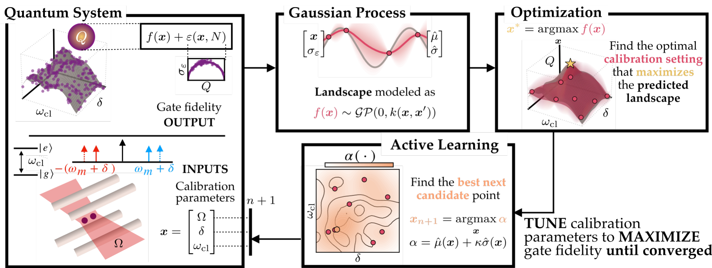
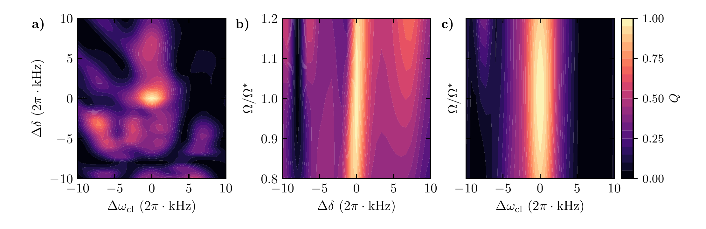

# QuantumFidelityOptimization

This repository implements heteroscedastic Gaussian Process Bayesian Optimization (GP-UCB) for calibrating trapped-ion Mølmer–Sørensen (MS) gates. It is the code and data behind *Active Learning for Calibrating Entangling Gates via Surrogate-Based Optimization* ([arXiv:2607.00284](https://arxiv.org/abs/2607.00284)).

<p align="center">
  
</p>

## Methodology

The optimizer sequentially learns the unknown mapping from control parameters to the noisy score while aiming to maximize the gate fidelity by querying the quantum device only in the outer loop. Starting from 12 Latin-hypercube input points over the design space, each iteration $n$ performs four steps:

1. **Query the quantum system.** The calibration sequence is run at a candidate control vector $\bm{x}=(\Omega, \delta, \omega_{\mathrm{cl}})$ (Rabi frequency, sideband detuning, center-line detuning) with $N$ measurement shots that return a noisy score `Q = f(x) + ε(x, N)`. Only this score is observed.
2. **Fit the surrogate.** A Gaussian process with a Matérn-3/2 ARD kernel is conditioned on all measurements collected so far, each carrying its own known measurement variance (see [noise model](#calibration-system-and-noise-model)). The posterior gives a prediction mean $\hat{\mu}(\bm{x})$ and standard deviation $\hat{\sigma}(\bm{x})$ anywhere in the input space. Kernel hyperparameters are re-fit by marginal-likelihood maximization every `HYPER_EVERY = 10` iterations rather than at every step.
3. **Optimize the surrogate.** Through $\bm{x}^* = \text{arg max}_{\bm{x}} \:\hat{\mu}(\bm{x})$, the optimizer finds the maximum fidelity estimated by the surrogate. The optimization consists on a dense random search followed by L-BFGS on the top candidates as initial guesses. 
4. **Select the next measurement (active learning).** The next control vector maximizes the GP-UCB acquisition $\alpha\left(\cdot \right) = \hat{\mu}(\bm{x}) + \kappa \hat{\sigma}(\bm{x})$ with $\kappa = 1.96$, trading exploitation of the predicted optimum against exploration of uncertain regions. The selected point is measured by the system and appended to the training set of the surrogate. The loop repeats until the iteration budget is spent.

## Calibration system and noise model

<p align="center">
  
</p>

a) **The system.** Two ions with a qubit transition frequency $\omega_{\mathrm{cl}}$ and a shared motional mode with frequency $\omega_m$ can be entangled with a bichromatic laser field with frequencies $\omega_{b,r} = \omega_{\mathrm{cl}} \pm (\omega_m + \delta)$ and Rabi frequency $\Omega$ applied to each ion. The system is simulated in [IonSim.jl](https://github.com/HaeffnerLab/IonSim.jl) as a 100 µs square pulse under the Lamb-Dicke and rotating-wave approximations.

The calibration sequence starts in |gg⟩ and applies two MS(π/2) gates, which for perfectly tuned controls transfer all population to |ee⟩. The score is that target population,

```
Q(x) = clamp(P_ee, 0, 1)
```

where $(P_{gg}, P_{ge}, P_{eg}, P_{ee})$ are the set of state probabilities from a finite number of projective measurements.

b) **The noise.** Each evaluation estimates those probabilities from $N$ shots, so that

```
σ_ε² = P_ee (1 − P_ee) / N
```

The variance magnitude changes across the input space, depeding on the fidelity value. The heteroscedastic GP accommodates for a input-dependent noise model for better estimation of the fidelity values.

## Repository structure

```
QuantumFidelityOptimization/
├── src/
│   ├── CalibrationCode.jl        # module entry point + exports
│   ├── calibration.jl            # IonSim physics + estimators (ideal, Q_noisy, Q_varMS P_ee objective)
│   ├── ms_sequences.jl           # MS subgate pulse construction + population calculator
│   └── bayes_opt.jl              # heteroscedastic GP-UCB (HeteroGP, fit_heterogp, bayesopt_ucb)
│
├── scripts/
│   ├── run_main.sh                    # entry point: runs the full BO sweep
│   ├── main_opt.jl                    # distributed BO trace generator
│   ├── gp_fit_quality_study.jl        # GP fit quality vs. N_shots and n_pts
│   ├── contour_data_generation.jl     # 2D score heatmaps (Q_infinity landscapes)
│   ├── gp_data_generation.jl          # GP posterior slices for selected-N traces
│   └── plots.ipynb                    # figure generation: one cell per figure,
│                                       # shown inline and saved as PDF to figures/
│
├── figures/                          # PDFs written by scripts/plots.ipynb
│
├── examples/
│   ├── toy_standard_2d.jl    # GP-UCB on a 2D toy function, constant-σ noise
│   ├── toy_standard_3d.jl    # GP-UCB on a 3D toy function, constant-σ noise
│   ├── toy_hetero_2d.jl      # GP-UCB on a 2D toy function, binomial shot noise
│   ├── toy_hetero_3d.jl      # GP-UCB on a 3D toy function, binomial shot noise
│   ├── calib_standard2D.jl   # GP-UCB on Q_noisy (f_sb, A)
│   └── calib_standard3D.jl   # GP-UCB on Q_noisy (f_cl, f_sb, A)
│
├── data/
│   ├── traces_*/                        # per-seed BO trace CSVs (one dir per N)
│   ├── benchmark_trace_N*.txt           # aggregate statistics per N
│   ├── gp_fit_quality_3d_2ms.csv        # GP accuracy metrics vs. N_shots and n_pts
│   ├── slices_output.csv                # 1D GP posterior slices
│   └── train_near_output.csv            # training points near 1D axes
│
├── Project.toml
├── Manifest.toml
├── requirements.txt   # pinned Python deps for scripts/plots.ipynb
├── setup.sh           # automated setup script (Julia + IonSim + Python env)
├── setup_python.sh    # Python venv + Jupyter kernel setup (also called by setup.sh)
└── installation.md    # detailed installation notes
```

## Installation

IonSim is an unregistered package that requires a local development checkout. The automated script handles everything:

```bash
bash setup.sh
```

This installs Julia 1.11.6, clones IonSim v0.5.1, applies a required compatibility patch to `iontraps.jl`, and instantiates all other dependencies from the locked `Manifest.toml`. See [installation.md](installation.md) for details and manual steps.

## Running the pipeline

### 1. BO traces 

Runs 100 independent BO seeds for each shot count $N \in \{100, 1000, 10000, 100000, \infty \}$:

```bash
bash scripts/run_main.sh
```

Output is written to `data/traces_<tag>/` (one CSV per seed) and a summary text file per N in `data/`. The pre-generated data is already included in `data/`.

Key parameters (set in `run_main.sh`):

| Parameter | Value | Meaning |
|-----------|-------|---------|
| `N_ITER` | 100 | BO iterations per run |
| `N_INIT` | 12 | Latin hypercube initial design |
| `KAPPA` | 1.96 | GP-UCB exploration parameter |
| `BOUND_SCALE` | 0.5 | Search box half-width (normalized units) |
| `FREQ_SPAN_KHZ` | 10 | Physical frequency span per axis |

### 2. GP fit quality study

Evaluates GP posterior accuracy across training sizes $n \in \{10, 50, 100, 250, 500, 1000\}$ and shot counts $N \in \{100, 1000, 10000, 100000, \infty\}$:

```bash
julia --project=. scripts/gp_fit_quality_study.jl
```

Output: `data/gp_fit_quality_3d_2ms.csv`, `data/slices_output.csv`, `data/train_near_output.csv`.

### 3. Paper figure data (contour + GP slices)

Two more generators feed the figure notebook:

```bash
julia --project=. scripts/contour_data_generation.jl   # -> data/varms_2_heatmap_{rabi_sideband,rabi_fcl,sideband_fcl}.csv
julia --project=. scripts/gp_data_generation.jl         # -> data/gp_slices/, data/score_cache/
```

`contour_data_generation.jl` computes deterministic (N=∞) 2D score heatmaps over the 2×MS(π/2) sequence (the contour figure). `gp_data_generation.jl` picks, for each N ∈ {100, 1000, 10000, 100000, ∞}, the BO trace whose final Q_det is closest to the median across all 100 seeds (requires `scripts/run_main.sh` to have been run first), then replays its training set at iterations 10/30/50 and fits a GP snapshot at each (the GP-slices figure).

### A. Generating the figures

All figures live in one notebook, `scripts/plots.ipynb` - one cell per figure, each displayed inline and saved as a PDF into `figures/`. See [Python environment](installation.md#python-environment-for-figure-generation) for one-time setup, then:

```bash
source .venv/bin/activate
jupyter notebook scripts/plots.ipynb
```

Run all cells (select the "Python 3 (QuantumFidelityOptimization)" kernel if prompted). Each cell reads straight from `data/` — no dependency on the old standalone `python_scripts/*.py` files.

## Examples

Quick sanity checks:

```bash
# Toy functions — verify BO algorithms run correctly
julia --project=. examples/toy_standard_2d.jl
julia --project=. examples/toy_standard_3d.jl
julia --project=. examples/toy_hetero_2d.jl
julia --project=. examples/toy_hetero_3d.jl

# Calibration — BO directly on the IonSim physics model
julia --project=. examples/calib_standard2D.jl
julia --project=. examples/calib_standard3D.jl
```

## Core API

```julia
import Pkg; Pkg.activate(".")
include("src/CalibrationCode.jl")
using .CalibrationCode

# Physics model
base = ideal(100.0)                       # ideal parameters at t = 100 μs

# Calibration objective: P_ee of numMS MS(π/2) gates → (y, σy)
y, σy = Q_varMS(t, f_cl, f_sb, A; N=1000)

# Alternative Bell-parity estimator (used by the calib_standard examples)
q = Q_noisy(t, f_cl, f_sb, A; N=1000, phase_grid=0.0:0.2:π)

# Fit heteroscedastic GP
gp = fit_heterogp(X, y, σy)          # X: d×n, y/σy: n-vectors
μ, s2 = predict_latent(gp, x)        # posterior mean and variance
x_rec, m_rec, s_rec = recommend_mean(gp, bounds)   # GP-mean maximizer

# Run heteroscedastic GP-UCB
res = bayesopt_ucb(f; bounds, n_shots=500, n_init=12, n_iter=100, κ=1.96)
```

## Contact

For any queries or comments, please do not hesitate to contact the main developers provided below.

|                           |                                                                 |
|---------------------------|-----------------------------------------------------------------|
| Patricia García Caspueñas | [patcaspu@uw.edu](patcaspu@uw.edu) |
| Caleb Walton              | [calebcw@uw.edu](calebcw@uw.edu)                                |
| Filippo Zacchei           | [filippo.zacchei@polimi.it](filippo.zacchei@polimi.it)          |
